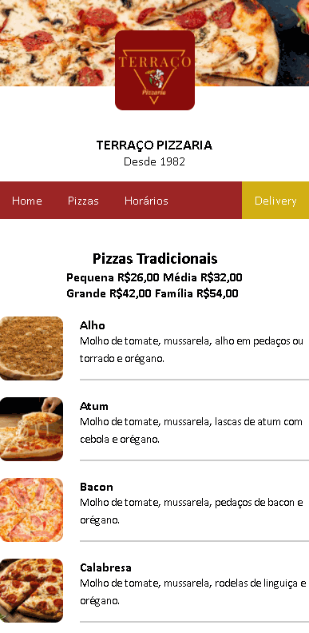
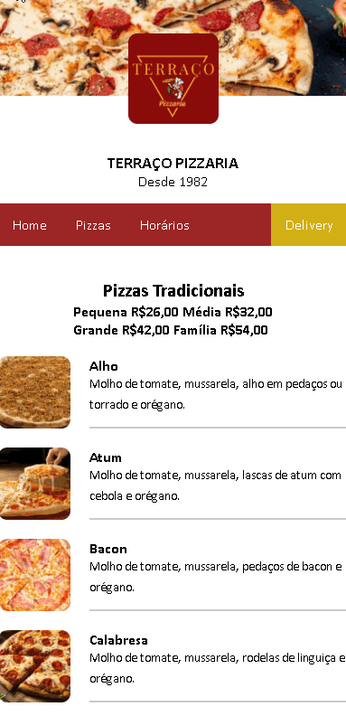

# Cardápio Terraço

 - Its a simple and easy on eyes QR Code of Restaurant Menu 

 - Terraço Pizzaria its a local pizzeria in Cabo Frio - Rio de janeiro, Brazil 

 - Currently working for customers
 

<a> *In this project, I used HTML and CSS // JS will be add later* </a>

 

## Features

- [X] Simple and responsive
- [X] Delivery Button 
- [ ] JavaScript

