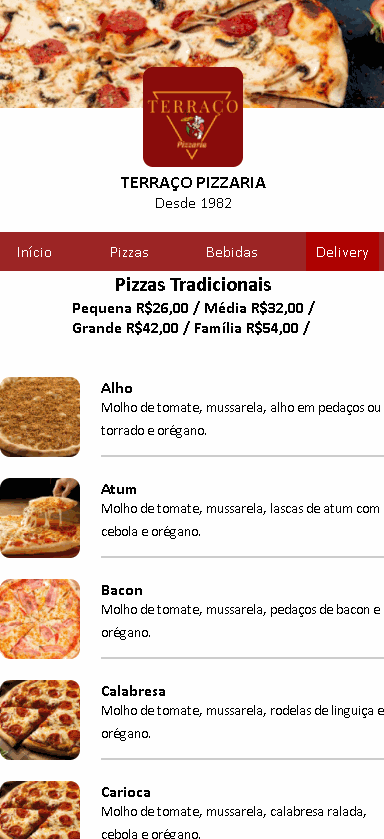

# Cardápio Terraço

```sh
- Its a simple and easy on eyes QR Code of Restaurant Menu
- Terraço Pizzaria its a local pizzeria in Cabo Frio - Rio de janeiro, Brazil
- Currently working for customers
```


<a> *In this project, I used HTML and CSS // JS will be add later* </a>


<br>

## Features

- [X] Simple and responsive
- [X] Delivery Button 
- [ ] JavaScript

